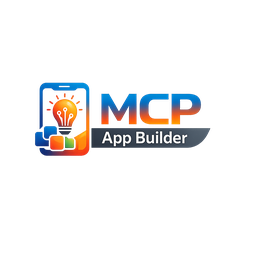

<p align="center">
  
</p>

<p align="center">
  <a href="https://github.com/mcp-tool-shop-org/mcp-app-builder/actions/workflows/ci.yml"></a>
  
  <a href="https://modelcontextprotocol.io"></a>
  <a href="https://mcp-tool-shop-org.github.io/mcp-app-builder/"></a>
</p>

# MCP アプリケーション ビルドツール

VS Codeから、インタラクティブなUIコンポーネントを備えたMCPサーバーをビルドできます。

## 概要

**MCP App Builder**は、開発者がMCP（Model Context Protocol）サーバーを迅速に作成、テストし、デプロイするのに役立つツールです。このツールは、2026年1月に発表された新しい**MCP Apps**規格に対応しており、AIとの会話に直接インタラクティブなUIコンポーネントを組み込むことが可能です。

## 特徴

### 足場
- **新規サーバー設定ウィザード**: ガイド付きの設定でMCPサーバーを作成します。
- **テンプレート**: 基本設定、UI付き設定、およびフル機能設定のサーバー構成を提供します。
- **自動構成**: TypeScript、MCP SDK、およびプロジェクト構造を自動的に設定します。

### 開発
- **スキーマ検証**: `mcp.json` および `mcp-tools.json` ファイルのリアルタイム検証
- **保存時の自動検証**: ファイルを保存する際に、スキーマのチェックを自動的に行う（設定可能）
- **型生成**: ツール定義からTypeScriptの型を生成
- **インテリセンス**: 設定ファイルに対するJSONスキーマのサポート

### テスト
- **テスト環境**: MCPツールに対するテストを実行します。
- **自動生成テスト**: ツール定義やサンプルに基づいて自動的に作成されたテスト。
- **出力チャンネル**: 合格/不合格のステータスを含む、整形されたテスト結果を出力します。

### ダッシュボード
- **視覚的なインターフェース**: すべてのコマンドに素早くアクセス可能
- **ワークスペースとの連携**: MCPプロジェクトを自動的に検出
- **ステータスバー**: MCPプロジェクトを開いている場合に、MCPのインジケーターを表示

## クイックスタートガイド

1. **拡張機能をインストールする**: VS Code Marketplaceからインストールできます（近日公開予定）。
2. **新しいサーバーを作成する**: `Cmd+Shift+P` → 「MCP: 新しいサーバー」を選択。
3. **テンプレートを選択する**:
- `basic`: シンプルな「Hello, World」サーバー
- `with-ui`: テーブルやグラフなどのUIコンポーネントを備えたサーバー
- `full`: ツール、リソース、およびプロンプトがすべて含まれた完全なサーバー

## キーボードショートカット

| ショートカット | コマンド |
| 以下に翻訳します。
----------
Please provide the English text you would like me to translate. | 以下の文章を日本語に翻訳してください。 |
| `Ctrl + Alt + N` (Macでは `Cmd + Alt + N`) | 新しいサーバー。 |
| `Ctrl + Alt + V` (Macでは `Cmd + Alt + V`)。 | スキーマを検証する。 |

## コマンド

| コマンド | 説明 |
| 以下の文章を日本語に翻訳してください。 | 以下に翻訳します。
------------- |
| `MCP: New Server` | 新しいMCPサーバープロジェクトを作成します。 |
| `MCP: Validate Schema` | 現在の mcp.json または mcp-tools.json ファイルを検証します。 |
| `MCP: Generate Types` | ツール定義からTypeScriptの型を生成します。 |
| `MCP: Test Server` | MCPツールに対してテストを実行してください。 |
| `MCP: Open Dashboard` | ビジュアルダッシュボードを開きます。 |

## 設定

| 設定。 | デフォルト設定 | 説明 |
| ご依頼ありがとうございます。翻訳を開始します。 | ご依頼ありがとうございます。翻訳を開始します。 | 以下に翻訳します。
------------- |
| `mcp-app-builder.defaultTemplate` | `basic` | 新しいサーバーのデフォルトテンプレート（ベーシック、UI付き、フル機能）。 |
| `mcp-app-builder.autoValidate` | `true` | 保存時にスキーマを自動的に検証します。 |
| `mcp-app-builder.testPort` | `3000` | MCPテストサーバー用のポート。 |

## MCPアプリケーションのUIコンポーネント

この拡張機能は、MCP Apps UIコンポーネント用のビルド機能を提供します。

```typescript
import { table, chart, form, card } from '@mcp-app-builder/ui-components';

// Create a search results table
const results = table(
  [
    { key: 'name', header: 'Name', sortable: true },
    { key: 'status', header: 'Status' },
  ],
  data,
  { pageSize: 10 }
);

// Create a dashboard with metrics
const dashboard = dashboard({
  title: 'Analytics',
  metrics: [
    { label: 'Users', value: 1234, change: 12 },
    { label: 'Revenue', value: '$5,678', change: -3 },
  ],
  chart: lineChart,
});
```

## ファイル構造

生成されたMCPサーバープロジェクトは、以下の構造に従います。

```
my-mcp-server/
├── mcp.json           # Server configuration
├── mcp-tools.json     # Tool definitions
├── package.json       # Node.js dependencies
├── tsconfig.json      # TypeScript configuration
└── src/
    ├── index.ts       # Server entry point
    ├── resources.ts   # Resource handlers (full template)
    └── prompts.ts     # Prompt handlers (full template)
```

## 開発

### 前提条件

- Node.js 18 以降のバージョン
- VS Code 1.85 以降のバージョン

### セットアップ

```bash
git clone https://github.com/mcp-tool-shop-org/mcp-app-builder
cd mcp-app-builder
npm install
npm run compile
```

### ランニング

VS Codeで「F5」キーを押すと、拡張機能開発環境が起動します。

### テスト

```bash
npm test
```

## ロードマップ

### 第1段階（現在） - 決定論的な基盤の確立
- [x] テンプレートを使用したプロジェクトの初期設定
- [x] スキーマ検証システム
- [x] スキーマからの型定義の自動生成
- [x] UIコンポーネントの基本要素
- [x] テスト環境の基盤
- [x] ダッシュボードのWebビュー

### 第2段階：AIを活用した開発
- [ ] 自然言語からのAIツール自動生成
- [ ] ツール操作者向けのインテリジェントなコード補完機能
- [ ] 自動ドキュメント生成機能

### 第3段階：出版と流通
- [ ] MCPレジストリへのワンクリック公開
- [ ] バージョン管理
- [ ] 依存関係の解決

### 第4段階 - ビジュアルビルド機能
- [ ] ドラッグ＆ドロップによるUIコンポーネント作成ツール
- [ ] MCPアプリケーションのリアルタイムプレビュー機能
- [ ] 視覚的なフローエディタ

## 貢献する

ご協力をお待ちしております！ 貢献に関する詳細なガイドラインは、近日公開予定です。

## ライセンス

マサチューセッツ工科大学

## リンク

- [モデルコンテキストプロトコル](https://modelcontextprotocol.io)
- [MCPアプリケーション仕様](http://blog.modelcontextprotocol.io/posts/2026-01-26-mcp-apps/)
- [GitHub組織](https://github.com/mcp-tool-shop-org)

---

MCP App Builderで構築されました。
